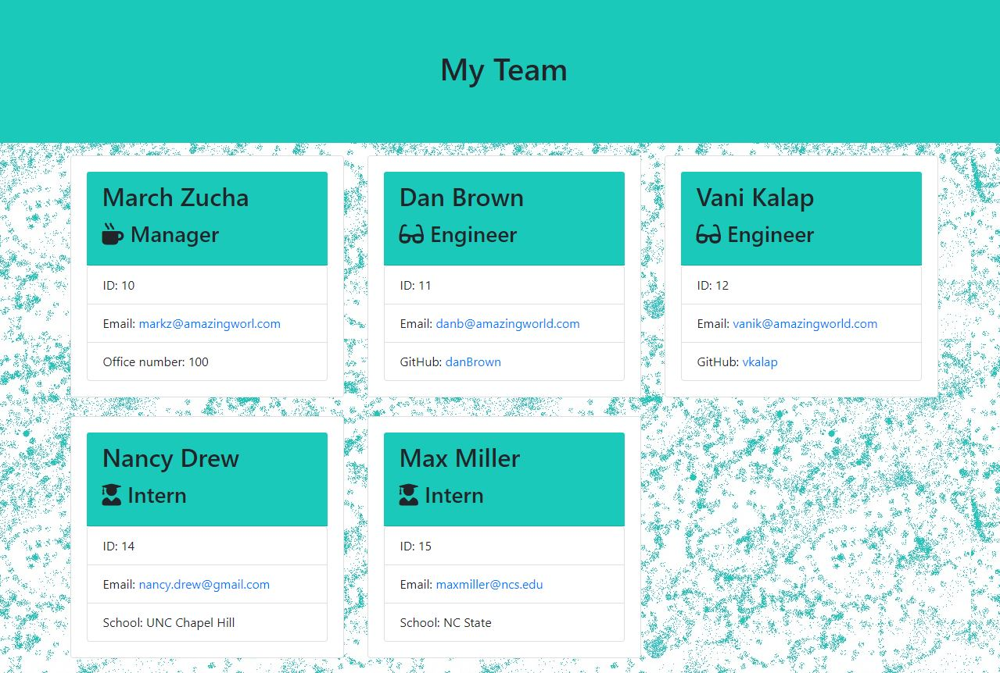

# Team Profile Generator

## Description
This Application creates a html file for a team using the information provided by user for different roles of employees. Designed and developed using Object Oriented Concepts. It uses npm-inquirer for input and renders this information to a html file.
## Table of Contents
* [Installation](#installation)
* [Usage](#usage)
* [License](#license)
* [Contributing](#contributing)
* [Tests](#tests)
* [Questions](#questions)
## Installation
This application is located at https://github.com/vkalaparthy/Team-Profile-Generator, clone this and run npm install to install all the packages that are used for this app.
## Usage
Run app.js at the terminal  using the command node app.js and a series of questions will be asked to get the information about the team embers and their roles. The questions are based on roles of the employees and this app does not let you create more than one manager.

Answers collected from CLI interface are created as Objects and these objects render to html file for this team.  Generated "team.html" file is in output folder.  If there is no folder, this app will create a folder and create a team.html file.  If there is a already an existing team.html, this app will overwrite the file with new information.

## License

## Contributing
## Tests
 1. Employee.test.js
 2. Manager.test.js 
 3. Engineer.test.js
 4. Intern.test.js
## Questions
* Vani Kalaparthy
  * https://github.com/vkalaparthy
  * kalaparthy.vani@gmail.com
  
