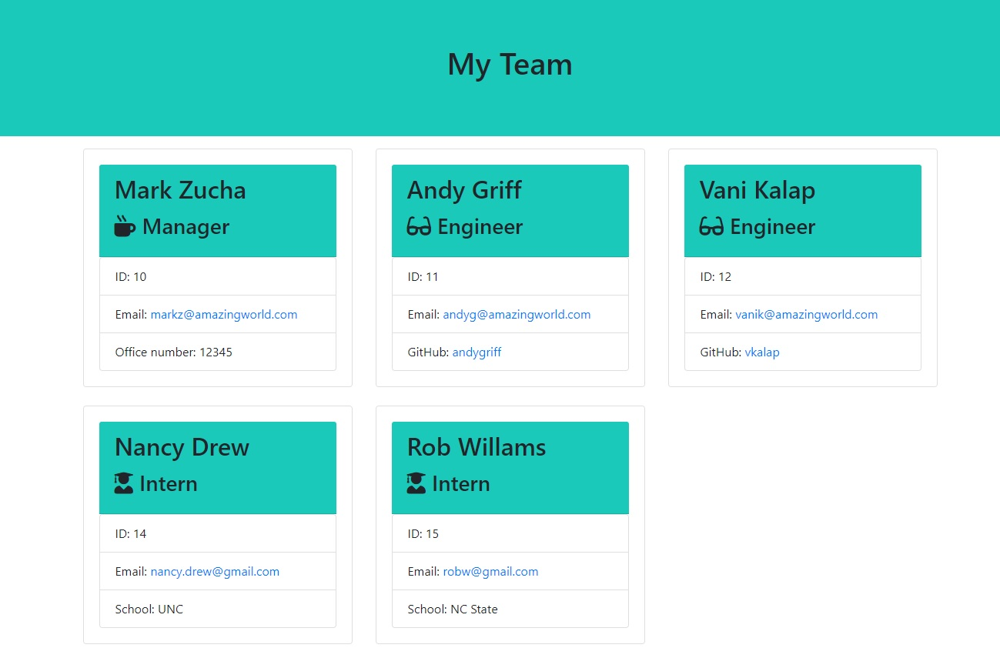

# buildingTeam

## Description
This Application creates a html file using the information provided by user. It used npm-inquirer for input and designed and developed using Object Oriented Concepts.
## Table of Contents
* [Installation](#installation)
* [Usage](#usage)
* [License](#license)
* [Contributing](#contributing)
* [Tests](#tests)
* [Questions](#questions)
## Installation
This application is located at , clone this and build your own team's html file.
## Usage
Run app.js at the terminal  using the command node app.js and a series of questions will be asked to get the information about the team. The questions are based on employee role and after you are done with answering all question on CLI, using OOP objects a html file for this team will be generated in output folder and the name of the html file will be team.html.  If there is no folder, this app will create a folder and create a team.html file.  If there is a already an existing team.html, this app will overwrite the file with new information.

## License

## Contributing
## Tests
Employee.test.js, Manager.test.js, Engineer.test.js, Intern.test.js
## Questions
* Vani Kalaparthy
  * https://github.com/vkalaparthy
  * kalaparthy.vani@gmail.com
  
